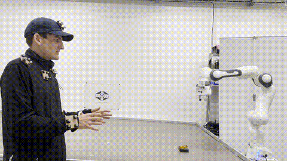
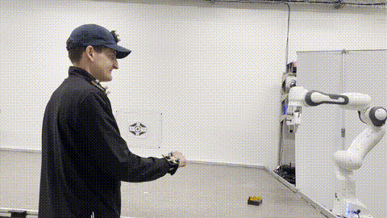
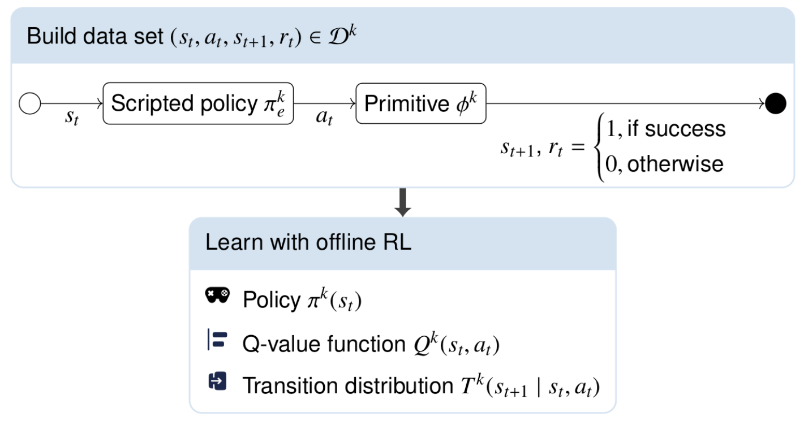
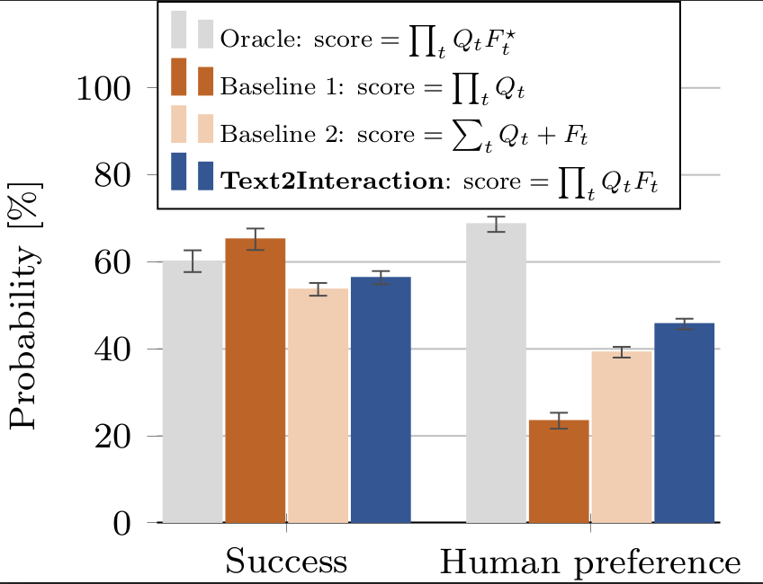

# Text2Interaction planning and simulation
This is the planning and simulation framework used in *"Text2Interaction: Establishing Safe and Preferable Human-Robot Interaction,"* presented at CoRL 2024.
This repository is based on [STAP](https://sites.google.com/stanford.edu/stap) *"Sequencing Task-Agnostic Policies"*. 

For a brief overview of our work, please refer to our [project page](https://sites.google.com/view/text2interaction/).

Further details can be found in our paper available on [arXiv](https://arxiv.org/abs/2408.06105v1).


<p align="center">
  <table>
    <tr>
      <td><p align="center">Without Text2Interaction</p></td>
      <td><p align="center">With Text2Interaction</p></td>
    </tr>
  </table>
</p>

<!--


-->

# Table of Contents
1. [Text2Interaction planning and simulation](#text2interaction-planning-and-simulation)
    - [Overview](#overview)
2. [Setup](#setup)
    - [Cloning](#cloning)
    - [Docker installation](#docker-installation)
    - [Manual installation](#manual-installation)
3. [Usage Instructions](#usage-instructions)
    - [Basic Usage](#basic-usage)
    - [Model Checkpoints](#model-checkpoints)
    - [Training Skills](#training-skills)
    - [Evaluating Planning](#evaluating-planning)
4. [Citation](#citation)


# Overview

The Text2Interaction framework can be broken down into three phases: 
 1. Train skills offline (i.e. policies, Q-functions, dynamics models, uncertainty quantifers)
 2. Generate preference functions (can be found in [fm-planning](https://github.com/agiachris/fm-planning/tree/t2i))
 3. Plan with skills online (i.e. motion planning, task and motion planning).
We provide implementations for phases 1 and 3 in this repo:

### :hammer_and_wrench: Train Skills Offline
- **Skill library:** A suite of reinforcement learning (RL) and inverse RL algorithms to learn three skills: `Pick`, `Place`, and `Static_handover`. Also supported are `Push` and `Pull` but not tested.
- **Learned models:** We learn a policy $\pi^k(a \mid s)$, a Q-value function $Q^K(s, a)$, and a transition distribution $T^k(s_{t+1} \mid s_t, a_t)$ per primitive from simulated rollouts. 

### :rocket: Plan with Skills Online
- **Motion planners (STAP):** A set of sampling-based motion planners including randomized sampling, cross-entropy method, planning with uncertainty-aware metrics, and combinations. Our experiments in Text2Interaction uses the CEM planner.
- **Task and motion planners (TAMP):** Coupling PDDL-based task planning with STAP-based motion planning. You can either generate entire task plans directly from the user instruction or you can generate task goals in PDDL an then plan to the goal. 

### :card_index_dividers:	Additionals
- **3D Environments:** PyBullet tabletop manipulation environment with domain randomization.
- **Human animation:** Our simulation includes a human, which is animated based on CMU motion capture data.
- **Safety shield** We provide safety guarantees for the human user using our [provably safe controller](https://github.com/JakobThumm/sara-shield/).

# Setup
Make sure to properly [clone](#cloning) this repo.
Then, you can either use the [Dockerfiles provided](#docker-installation) (for training purposes) or [setup this repo manually](#manual-installation) (for debugging).

## Cloning
Clone this repo with submodules
```
git clone --recurse-submodules git@github.com:JakobThumm/STAP.git
```
If you forgot to clone with submodules, make sure to add them now:
```
git submodule init
git submodule update --recursive
```

## Docker installation
To build and run the docker container with GPU, use
```
./build_docker_train.sh user gpu
./run_docker_train.sh user gpu
```
and on CPU use 
```
./build_docker_train.sh user
./run_docker_train.sh user
```
It is likely that you need a specific CUDA version to run the GPU docker. We provide Dockerfiles for version 11.8 and 12.1.

## Manual installation

### System Requirements
This repository is primarily tested on Ubuntu 20.04 with Python 3.8.10.
For all non-python requirements, see the requirements list in the Dockerfiles.

### Installation
Python packages are managed through conda 
```
conda env create -f environment.yml
```
or pip
```
# Install torch with the correct CUDA version of your GPU.
pip install torch==2.1.0 torchvision==0.16.0 torchaudio==2.1.0 networkx==3.0 --index-url https://download.pytorch.org/whl/cu118 swig
pip install --upgrade pip && pip install -r requirements.txt
```

#### Safety shield installation
First, install Eigen3.4 using:
```
curl -LJO https://gitlab.com/libeigen/eigen/-/archive/3.4.0/eigen-3.4.0.tar.bz2 && \
    tar -xvf eigen-3.4.0.tar.bz2 && \
    rm eigen-3.4.0.tar.bz2

cd eigen-3.4.0/build
cmake .. && make install
cd ../..
echo 'export EIGEN3_INCLUDE_DIR=$(pwd)' >> ~/.bashrc
source ~/.bashrc
```

Then install `sara-shield`
```
cd third_party/sara-shield
python setup.py install
cd ../..
```

#### STAP installation
Install `scod-regression` using
```
pip install third_party/scod-regression/
```
Install `STAP` using
```
pip install .
```

# Usage Instructions
You can either use our [pre-trained models](#model-checkpoints) or [train the skills](#training-skills) yourselves.
After retrieving the models, you can evaluate the models in planning.

## Basic Usage
STAP supports [training skills](#training-skills), and composing these components at test-time for [planning](#evaluating-planning).
- **STAP module:** The majority of the project code is located in the package `stap/`. 
- **Scripts:** Code for launching training, experiments, debugging, plotting, and visualization is under `scripts/`.
- **Configs:** Training and evaluation functionality is determined by `.yaml` configuration files located in `configs/`.

## Model Checkpoints
As an alternative to [training the skills](#training-skills) from scratch, we provide checkpoints that can be downloaded and directly used to [evaluate STAP planners](#evaluating-planning).
Run the following commands to download the model checkpoints to the default `models/` directory (this requires ~10GBs of disk space):
 - Demonstration data used to train inverse RL skills (`datasets`). This is not required for the evaluation.
    ```bash
    bash scripts/download/download_datasets.sh
    ```
 - Skills trained with [inverse RL](#inverse-reinforcement-learning) (`policies_irl`), the Q-value function (`value_fns_irl`) and their dynamics models (`dynamics_irl`).
    ```bash
    bash scripts/download/download_models.sh
    ```
 - Evaluation results that correspond to [evaluating Text2Interaction](#evaluating-motion-planning).
    ```bash
    bash scripts/download/download_results.sh
    ```

## Training Skills



Skills in STAP are trained independently in custom environments.
We provide an inverse RL pipeline for training skills, which can be executed using the [docker image](#docker-installation). Running 
Training the skills consists of 4 steps:

 1. [Generate rollouts](#generate-rollouts)
    ```bash
    ./run_docker_train.sh user gpu
    bash scripts/data/generate_all_datasets_tmux.sh
    ```
 2. [Train Q-value functions](#train-q-value-functions)
    ```bash
    bash scripts/train/train_values_docker.sh
    ```
 3. [Train policies](#train-policies)
    ```bash
    bash scripts/train/train_policies_docker.sh
    ```
 4. [Train dynamics distributions](#train-dynamics-distributions)
    ```bash
    bash scripts/train/train_dynamics_docker.sh
    ```

### Generate rollouts
First, we generate the rollout data to train our models on. The training data consists of rollouts $(s_0, a_0, s_1, r_0)$ in randomized start states $s_0$.
The start states are checked for manipulability of the objects and discarded if objects could not be reached.
With a probability of $\alpha$, an action $a_0$ is sampled from a hand-scripted expert policy and slightly randomized. With a probability of $1-\alpha$, the action is sampled randomly from the entire action space.
The parameter $\alpha$ is tuned to achieve $\approx 50\%$ successful rollouts in the dataset.
The reward $r_0=1$ if the execution of the primitive is successful and $r_0=0$ if the primitive failed, e.g., because gripping was not successful, the robot collided with the environemnt, or solving the inverse kinematics failed.

### Train Q-value functions
For each primitive, we train $Q(s,a)$ to estimate the likelihood of a successful primitive execution starting from state $s$ and executing the primitive with action $a$. 
Since we only execute one timestep, the problem reduces to a multi-arm bandit problem.

### Train policies
For each primitive, we train $\pi(a \mid s)$ to maximize the Q-value function.

### Train dynamics distributions
For each primitive, we train the transition distribution $T(s_{t+1} \mid s_t, a_t)$ to predict the next state after executing action $a_t$ in state $s_t$. Since we have strong prior knowledge about the primitive execution, we replace the network prediction of certain objects with hand-scripted functions, e.g., we know where the end-effector is going to be after executing a primitive with action $a_t$. This strongly improves the performance of our planning pipeline.

## Evaluating Planning
We can evaluate these models and the generated preference functions using the scripts provided in `scripts/eval/`. 

### Evaluating screwdriver handover
The recurring example in Text2Interaction is the screwdriver handover. You can test this in simulation using
- With custom preference function:
```bash
python scripts/eval/eval_planners.py --planner-config configs/pybullet/planners/policy_cem_screwdriver_custom_fns.yaml --env-config configs/pybullet/envs/official/sim_domains/screwdriver_handover/task0.yaml --policy-checkpoints models/policies_irl/pick/final_model.pt models/policies_irl/place/final_model.pt models/policies_irl/static_handover/final_model.pt --dynamics-checkpoint models/dynamics_irl/pick_place_static_handover_dynamics/final_model.pt --use_informed_dynamics 1 --seed 0 --gui 1 --closed-loop 1 --num-eval 100 --path plots/planning/screwdriver_handover/task0 --verbose
```
- Without custom preference function:
```bash
python scripts/eval/eval_planners.py --planner-config configs/pybullet/planners/policy_cem_no_custom.yaml --env-config configs/pybullet/envs/official/sim_domains/screwdriver_handover/task0.yaml --policy-checkpoints models/policies_irl/pick/final_model.pt models/policies_irl/place/final_model.pt models/policies_irl/static_handover/final_model.pt --dynamics-checkpoint models/dynamics_irl/pick_place_static_handover_dynamics/final_model.pt --use_informed_dynamics 1 --seed 0 --gui 1 --closed-loop 1 --num-eval 100 --path plots/planning/screwdriver_handover/task0 --verbose
```

We evaluated this behavior on a real-world Frank Research 3 robot. The code for that is provided in the `ROS-noetic` branch. In our real-world setup, we use `sara-shield` to guarantee the safety of the human user. The code for deploying `sara-shield` together with this repo can be found [here](https://github.com/JakobThumm/sara_shield_ros).

### Ablation study



We evaluate four models in our ablation study:
 - Oracle: hand scripted preference functions run with the default Text2Interaction formulation.
 - Baseline 1: only optimize for task success
 - Baseline 2: optimize for the sum of task success and preference function. Uses the generated preference functions of the LLM.
 - Text2Interaction: optimize for the product of task success and preference function. Uses the generated preference functions of the LLM.

To reproduce our evaluation, run:
 - Oracle
    ```bash
    ./run_docker_train.sh user gpu
    ./scripts/eval/eval_object_arrangement_oracle.sh
    ```
 - Baseline 1
    ```bash
    ./run_docker_train.sh user gpu
    ./scripts/eval/eval_object_arrangement_baseline.sh
    ```
 - Baseline 2
    ```bash
    ./run_docker_train.sh user gpu
    ./scripts/eval/eval_object_arrangement_additive_baseline.sh
    ```
 - Text2Interaction
    ```bash
    ./run_docker_train.sh user gpu
    ./scripts/eval/eval_object_arrangement_ablation.sh
    ```

### Summarize the results
To summarize the generated ablation results, run
```
./models/mv_all_eval_files.sh
python scripts/eval/eval_planner_summary.py --eval-path models/eval/planning/object_arrangement/
```
The resulting summary can be found in `models/eval/planning/object_arrangement/summary.csv`.


# Citation
Sequencing Task-Agnostic Policies and Text2Interaction is offered under the MIT License agreement. 
If you find Text2Interaction useful, please consider citing our work:
```
@inproceedings{thumm_2024_Text2InteractionEstablishing,
  title = {Text2Interaction: Establishing Safe and Preferable Human-Robot Interaction},
  shorttitle = {Text2Interaction},
  booktitle = {8th Annual Conference on Robot Learning},
  author = {Thumm, Jakob and Agia, Christopher and Pavone, Marco and Althoff, Matthias},
  year = {2024},
  url = {https://openreview.net/forum?id=s0VNSnPeoA&referrer=%5BAuthor%20Console%5D(%2Fgroup%3Fid%3Drobot-learning.org%2FCoRL%2F2024%2FConference%2FAuthors%23your-submissions)},
  langid = {english},
}
```
