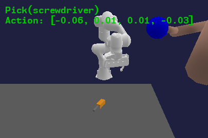

# Synthetic Vision Data Generator
- run ‘generate_bbox.py’ to generate instructions directly from text prompts, or run ‘gradio_seg2image.py’ or ‘gradio_scribble2image.py’ to launch gradio UI to generate images with segmentation or scribble inputs.
- For example images see simulation and real_world folders.

# VL-based Preference Codegen
- real_word_generation.py
- simulation_generation.py

# VL2Interaction planning and simulation
This is the planning and simulation framework used in *"VL2Interaction: Establishing Safe and Preferable Human-Robot Interaction,"*.


<p align="center">
  <table>
    <tr>
      <td><p align="center">Baseline (Text2Interaction) Success case</p></td>
      <td><p align="center">Baseline (Text2Interaction) Failure case</p></td>
    </tr>
  </table>
</p>
<p align="center">
  <table>
    <tr>
      <td><p align="center">VL2Interaction Success case</p></td>
      <td><p align="center">VL2Interaction Failure case</p></td>
    </tr>
  </table>
</p>
<p align="center">
  <table>
    <tr>
      <td><p align="center">Generalized VL2Interaction Success case</p></td>
      <td><p align="center">Generalized VL2Interaction Failure case</p></td>
    </tr>
  </table>
</p>
<!--


-->

# Table of Contents
1. [VLInteraction planning and simulation](#text2interaction-planning-and-simulation)
    - [Overview](#overview)
2. [Setup](#setup)
    - [Cloning](#cloning)
    - [Docker installation](#docker-installation)
3. [Usage Instructions](#usage-instructions)
    - [Basic Usage](#basic-usage)
    - [Training Skills](#training-skills)
    - [Evaluating Planning](#evaluating-planning)


# Overview

The VL2Interaction framework can be broken down into three phases: 
 1. Synthetic Vision Data Generator (our approach): generate preferred and not preferred vision demonstrations data for downstream preference codegen tasks
 2. Generalized Vision Language Preference Codegen:
    - baseline (human heuristic based, text-only): can be found in [fm-planning](https://github.com/agiachris/fm-planning/tree/t2i))
    - our approach (Generalized Vision Language Preference Codegen): real_word_generation.py, simulation_generation.py
      - preference function generation
      - non-Euclidean reasoning topology generated for downstream interaction tasks
 3. Train skills offline (i.e. policies, Q-functions, dynamics models, uncertainty quantifers)
 4. Plan with skills online (i.e. motion planning, task and motion planning).
We provide implementations for phases 1 and 3 in this repo:

### :hammer_and_wrench: Train Skills Offline
- **Skill library:** A suite of reinforcement learning (RL) and inverse RL algorithms to learn three skills: `Pick`, `Place`, and `Static_handover`. Also supported are `Push` and `Pull` but not tested.
- **Learned models:** We learn a policy $\pi^k(a \mid s)$, a Q-value function $Q^K(s, a)$, and a transition distribution $T^k(s_{t+1} \mid s_t, a_t)$ per primitive from simulated rollouts. 

### :rocket: Plan with Skills Online
- **Motion planners (STAP):** A set of sampling-based motion planners including randomized sampling, cross-entropy method, planning with uncertainty-aware metrics, and combinations. Our experiments in Text2Interaction uses the CEM planner.
- **Task and motion planners (TAMP):** Coupling PDDL-based task planning with STAP-based motion planning. You can either generate entire task plans directly from the user instruction or you can generate task goals in PDDL an then plan to the goal. 

### :card_index_dividers:	Additionals
- **3D Environments:** PyBullet tabletop manipulation environment with domain randomization.
- **Human animation:** Our simulation includes a human, which is animated based on CMU motion capture data.
- **Safety shield** We provide safety guarantees for the human user using our [provably safe controller](https://github.com/JakobThumm/sara-shield/).

# Setup
Make sure to properly [clone](#cloning) this repo.
Then, you can either use the [Dockerfiles provided](#docker-installation) (for training purposes) or [setup this repo manually](#manual-installation) (for debugging).

## Cloning
Clone this repo with submodules
```
git clone --recurse-submodules git@github.com:cicimnmn/VLR_16824_project.git
```
If you forgot to clone with submodules, make sure to add them now:
```
git submodule init
git submodule update --recursive
```

## Docker installation
To build and run the docker container with GPU, use
```
./build_docker_train.sh user gpu
./run_docker_train.sh user gpu
```
and on CPU use 
```
./build_docker_train.sh user
./run_docker_train.sh user
```
It is likely that you need a specific CUDA version to run the GPU docker. We provide Dockerfiles for version 11.8 and 12.1.


# Usage Instructions
You can either use our [pre-trained models](#model-checkpoints) or [train the skills](#training-skills) yourselves.
After retrieving the models, you can evaluate the models in planning.

## Basic Usage
STAP supports [training skills](#training-skills), and composing these components at test-time for [planning](#evaluating-planning).
- **STAP module:** The majority of the project code is located in the package `stap/`. 
- **Scripts:** Code for launching training, experiments, debugging, plotting, and visualization is under `scripts/`.
- **Configs:** Training and evaluation functionality is determined by `.yaml` configuration files located in `configs/`.

## Training Skills


Skills in STAP are trained independently in custom environments.
We provide an inverse RL pipeline for training skills, which can be executed using the [docker image](#docker-installation). Running 
Training the skills consists of 4 steps:

 1. [Generate rollouts](#generate-rollouts)
    ```bash
    ./run_docker_train.sh user gpu
    bash scripts/data/generate_all_datasets_tmux.sh
    ```
 2. [Train Q-value functions](#train-q-value-functions)
    ```bash
    bash scripts/train/train_values_docker.sh
    ```
 3. [Train policies](#train-policies)
    ```bash
    bash scripts/train/train_policies_docker.sh
    ```
 4. [Train dynamics distributions](#train-dynamics-distributions)
    ```bash
    bash scripts/train/train_dynamics_docker.sh
    ```

### Generate rollouts
First, we generate the rollout data to train our models on. The training data consists of rollouts $(s_0, a_0, s_1, r_0)$ in randomized start states $s_0$.
The start states are checked for manipulability of the objects and discarded if objects could not be reached.
With a probability of $\alpha$, an action $a_0$ is sampled from a hand-scripted expert policy and slightly randomized. With a probability of $1-\alpha$, the action is sampled randomly from the entire action space.
The parameter $\alpha$ is tuned to achieve $\approx 50\%$ successful rollouts in the dataset.
The reward $r_0=1$ if the execution of the primitive is successful and $r_0=0$ if the primitive failed, e.g., because gripping was not successful, the robot collided with the environemnt, or solving the inverse kinematics failed.

### Train Q-value functions
For each primitive, we train $Q(s,a)$ to estimate the likelihood of a successful primitive execution starting from state $s$ and executing the primitive with action $a$. 
Since we only execute one timestep, the problem reduces to a multi-arm bandit problem.

### Train policies
For each primitive, we train $\pi(a \mid s)$ to maximize the Q-value function.

### Train dynamics distributions
For each primitive, we train the transition distribution $T(s_{t+1} \mid s_t, a_t)$ to predict the next state after executing action $a_t$ in state $s_t$. Since we have strong prior knowledge about the primitive execution, we replace the network prediction of certain objects with hand-scripted functions, e.g., we know where the end-effector is going to be after executing a primitive with action $a_t$. This strongly improves the performance of our planning pipeline.

## Evaluating Planning
We can evaluate these models and the generated preference functions using the scripts provided in `scripts/eval/`. 

### Evaluating screwdriver handover
 The screwdriver example can be tested in simulation using
- With custom preference function:
```bash
python eval_planners.py --planner-config configs/pybullet/planners/policy_cem_screwdriver_custom_fns.yaml --env-config configs/pybullet/envs/official/sim_domains/screwdriver_handover/task0.yaml --policy-checkpoints models/policies_irl/pick/final_model.pt models/policies_irl/place/final_model.pt models/policies_irl/static_handover/final_model.pt --dynamics-checkpoint models/dynamics_irl/pick_place_static_handover_dynamics/final_model.pt --use_informed_dynamics 1 --seed 0 --gui 1 --closed-loop 1 --num-eval 100 --path plots/planning/screwdriver_handover/task0 --verbose
```
- Without custom preference function:
```bash
python eval_planners.py --planner-config configs/pybullet/planners/policy_cem_no_custom.yaml --env-config configs/pybullet/envs/official/sim_domains/screwdriver_handover/task0.yaml --policy-checkpoints models/policies_irl/pick/final_model.pt models/policies_irl/place/final_model.pt models/policies_irl/static_handover/final_model.pt --dynamics-checkpoint models/dynamics_irl/pick_place_static_handover_dynamics/final_model.pt --use_informed_dynamics 1 --seed 0 --gui 1 --closed-loop 1 --num-eval 100 --path plots/planning/screwdriver_handover/task0 --verbose
```
